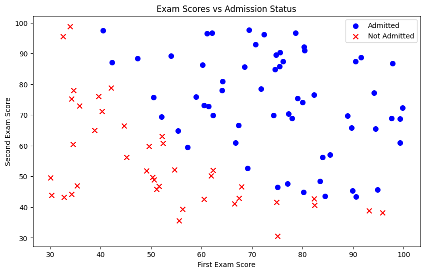
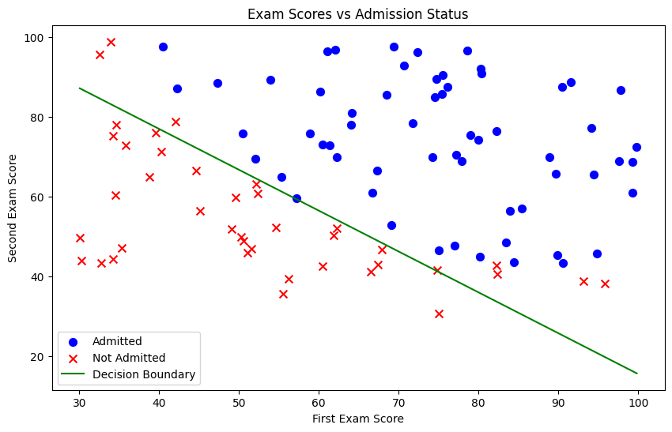
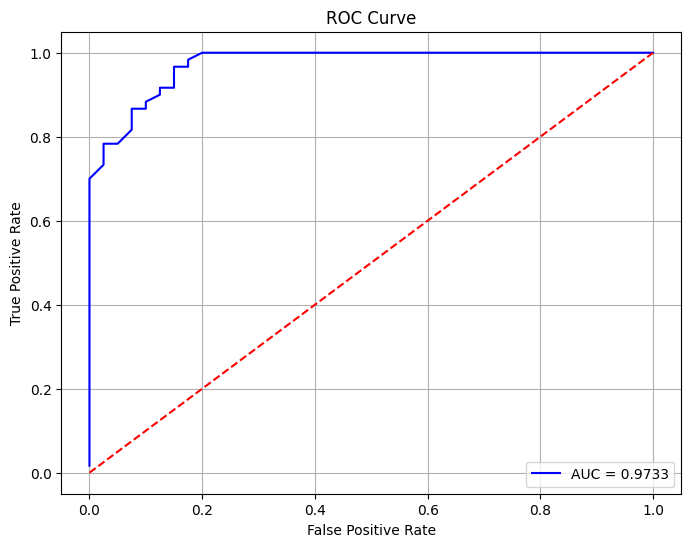
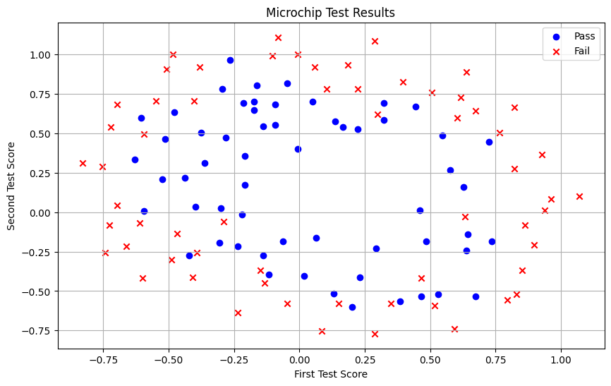
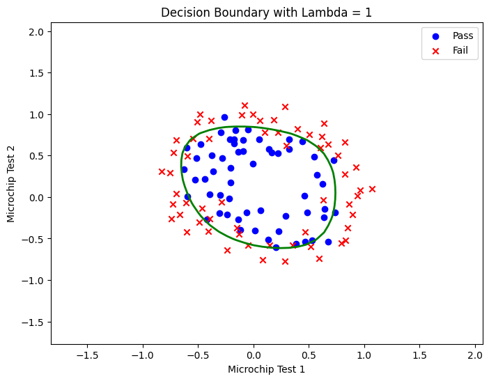

# Exercise 3: Logistic Regression

This project contains a Jupyter notebook for a machine learning exercise on logistic regression.

The notebook implements logistic regression from scratch with NumPy and applies it to two classification problems:

- Predicting whether a student will be admitted to a university based on two exam scores.
- Predicting whether a microchip passes quality assurance based on two test results, using regularized logistic regression with polynomial feature mapping.

## Project Files

- `Exercise_3_Logistic_Regression.ipynb` - main notebook containing the assignment text, implementation, training code, plots, and evaluation.
- `assets/` - exported chart images from the notebook, used in this README.

The notebook expects the following data files to be available in the same folder:

- `ex2data1.txt` - student exam scores and admission labels.
- `ex2data2.txt` - microchip test results and pass/fail labels.

These data files are not currently included in this folder.

## What The Notebook Covers

### Logistic Regression

The first part builds a binary classifier for university admission. It includes:

- Loading and visualizing the training data.
- Implementing the sigmoid function.
- Implementing the logistic regression cost function.
- Computing gradients.
- Training parameters with stochastic gradient descent.
- Plotting the learned decision boundary.
- Predicting admission probability for a new student.
- Measuring training accuracy and plotting ROC/AUC-related metrics.

### Regularized Logistic Regression

The second part builds a classifier for microchip quality assurance. It includes:

- Loading and visualizing chip test data.
- Mapping two input features into polynomial features up to degree 6.
- Implementing regularized logistic regression cost and gradient.
- Training with a momentum-based optimization method.
- Plotting nonlinear decision boundaries for different regularization values.

## Example Outputs

### Student Admission Data

The first dataset compares two exam scores against the admission decision.



After training logistic regression, the notebook plots the learned linear decision boundary.



The notebook also evaluates the classifier with an ROC curve.



### Microchip QA Data

The second dataset is not linearly separable, so the notebook uses polynomial feature mapping and regularization.



With regularized logistic regression, the model learns a nonlinear decision boundary.



The notebook also compares the decision boundary with no regularization.


## Requirements

Install the Python packages used by the notebook:

```bash
pip install numpy pandas matplotlib jupyter
```

## How To Run

1. Place `ex2data1.txt` and `ex2data2.txt` in the project folder.
2. Start Jupyter:

```bash
jupyter notebook
```

3. Open `Exercise_3_Logistic_Regression.ipynb`.
4. Run the notebook cells from top to bottom.

## Notes

- The project is currently a single-notebook assignment, not a packaged Python application.
- The logistic regression algorithms are implemented manually for learning purposes rather than using scikit-learn.
